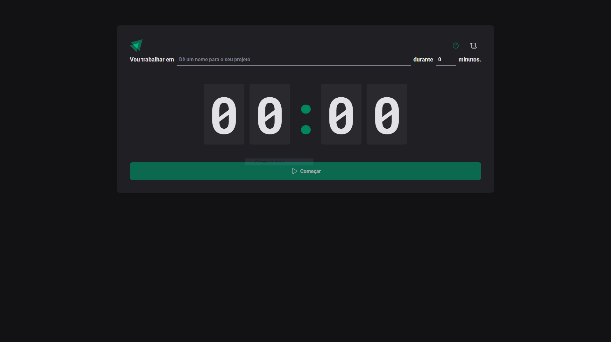

<h1 align="center"> Ignite Timer</h1>

  Voce pode encontrar demo do projeto no github pages nesse <a href="https://lupebreak.github.io/ignite-timer/">Link</a> ( TO DO )

  <a href="#-tecnologias">Tecnologias</a>&nbsp;&nbsp;&nbsp;|&nbsp;&nbsp;&nbsp;
  <a href="#-projeto">Projeto</a>&nbsp;&nbsfp;&nbsp;|&nbsp;&nbsp;&nbsp;
  <a href="#memo-licença">Licença</a>

  

 

  

## 🚀 Tecnologias

Esse projeto foi desenvolvido com as seguintes tecnologias:

- Javascript
- Vite
- ReactJS
- Git e Github

## 💻 Projeto

O Ignite timer é um cronometro para utilizar em tecnicas como pomodoro ou apenas como um cronometro! Mantendo o historico de suas atividades concluidas, interrompidas e em andamento.

## :memo: Licença

Esse projeto está sob a licença MIT.

---

Feito com ♥ by [LuPeBreak](https://github.com/LuPeBreak/) durante as aulas do Ignite ReactJS na [RocketSeat](https://www.rocketseat.com.br/).
